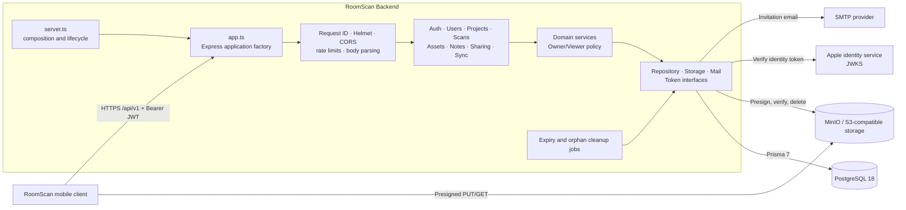
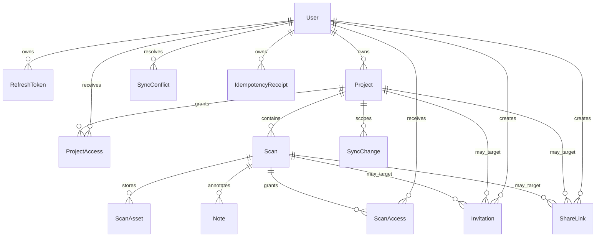

# RoomScan Backend

[](LICENSE)
[](https://nodejs.org/)
[](https://www.typescriptlang.org/)

**RoomScan Backend** is the API and synchronization service for RoomScan, a
mobile-first platform for organizing room scans, 3D model assets, spatial
notes, and shared project access.

The service provides Sign in with Apple authentication, Owner/Viewer
authorization, direct-to-object-storage uploads, invitation and reusable-link
sharing, and an offline-first synchronization feed. It is built as a modular
Express application with narrow infrastructure interfaces so the domain
services remain testable and independent of PostgreSQL, object storage, email,
and token-verification implementations.

- **Company:** [NUS Technology](https://www.nustechnology.com/)
- **Repository:** [nustechnology/RoomScan-BE](https://github.com/nustechnology/RoomScan-BE)
- **API documentation:** `http://localhost:3000/api-doc`

## Table of contents

- [Tech stack](#tech-stack)
- [Getting started](#getting-started)
- [Environment configuration](#environment-configuration)
- [Project structure](#project-structure)
- [System architecture](#system-architecture)
- [Core capabilities](#core-capabilities)
- [Data model](#data-model)
- [Main API routes](#main-api-routes)
- [Development commands](#development-commands)
- [Testing and CI](#testing-and-ci)
- [Project conventions](#project-conventions)
- [Troubleshooting](#troubleshooting)
- [License](#license)

---

## Tech stack

| Layer                       | Technology                                                                               |
| --------------------------- | ---------------------------------------------------------------------------------------- |
| Runtime                     | Node.js 24, Yarn 4 through Corepack, native ECMAScript modules                           |
| API                         | Express 5, TypeScript 5.9                                                                |
| Validation and API contract | Zod 4, `@asteasolutions/zod-to-openapi`, OpenAPI 3.1, Swagger UI                         |
| Database                    | PostgreSQL 18, Prisma ORM 7, Prisma PostgreSQL driver adapter                            |
| Authentication              | Sign in with Apple, JOSE, HS256 access and refresh JWTs                                  |
| Authorization               | Owner/Viewer permissions at project and scan scope                                       |
| Object storage              | Local development adapter, MinIO/S3-compatible production adapter                        |
| Email                       | Nodemailer SMTP adapter, development log adapter                                         |
| Security and resilience     | Helmet, CORS, IP rate limiting, request-size limits, idempotency, optimistic concurrency |
| Logging                     | Pino and Pino HTTP with request IDs and sensitive-value redaction                        |
| Testing                     | Vitest 4, Supertest, V8 coverage                                                         |
| Code quality                | ESLint 10, typescript-eslint, Prettier 3, Husky                                          |
| Runtime packaging           | Multi-stage Docker build, Docker Compose                                                 |

---

## Getting started

### Prerequisites

- Node.js 24 (`.nvmrc` pins the preferred patch version)
- Corepack
- Docker with Docker Compose, or another reachable PostgreSQL instance
- An Apple Services ID or native bundle identifier for real Apple identity
  tokens

The repository pins `yarn@4.17.1` and uses Yarn's `node-modules` linker for
compatibility with Prisma, Husky, editors, and container builds. Run all Yarn
commands from the repository root.

### Install and configure

```bash
git clone git@github.com:nustechnology/RoomScan-BE.git
cd RoomScan-BE

nvm install
nvm use
corepack enable
corepack install

cp .env.example .env
yarn install --immutable
yarn prisma:generate
```

Before starting the service, replace the placeholders for `APPLE_CLIENT_ID`,
`AUTH_ACCESS_TOKEN_SECRET`, `AUTH_REFRESH_TOKEN_SECRET`, and
`SYNC_CRYPTO_KEY`. The token secrets must contain at least 32 characters.
Generate the synchronization key as base64 for exactly 32 bytes:

```bash
openssl rand -base64 32
```

Never commit `.env`, provider credentials, token secrets, or encryption keys.

### Local development

The standard local workflow runs PostgreSQL in Docker and the API natively for
fast reloads. MinIO is optional because the default local storage adapter does
not persist uploaded bytes.

```bash
docker compose -f docker-compose.local.yml up db -d
yarn prisma:migrate:deploy
yarn dev
```

Open the local services:

- API: [http://localhost:3000](http://localhost:3000)
- Liveness: [http://localhost:3000/api/v1/health](http://localhost:3000/api/v1/health)
- Readiness: [http://localhost:3000/api/v1/ready](http://localhost:3000/api/v1/ready)
- Swagger UI: [http://localhost:3000/api-doc](http://localhost:3000/api-doc)
- OpenAPI JSON: [http://localhost:3000/api-doc.json](http://localhost:3000/api-doc.json)

To exercise real presigned upload and download URLs, configure the MinIO
variables in `.env` and start the optional local service:

```bash
docker compose -f docker-compose.local.yml up minio -d
```

MinIO exposes its API at `http://localhost:9000` and its console at
`http://localhost:9001` by default. Thumbnail display URLs are stable and
unsigned, so the configured bucket must allow public reads or sit behind a
public CDN/reverse proxy.

### Seeded local authentication

For local development without contacting Apple, set the following value in
`.env`:

```env
NODE_ENV=development
LOCAL_TEST_AUTH_ENABLED=true
```

Then seed the demonstration data and start the API:

```bash
yarn seed:local
yarn dev
```

Authenticate as the seeded Owner through the normal Apple endpoint:

```bash
curl -X POST http://localhost:3000/api/v1/auth/apple \
  -H 'Content-Type: application/json' \
  -d '{"identityToken":"roomscan-local-test-user"}'
```

Use `roomscan-local-pending-invite-user` instead to authenticate as the seeded
recipient of a pending invitation. Both shortcuts are accepted only when
`NODE_ENV=development` and `LOCAL_TEST_AUTH_ENABLED=true`.

### Production-style Docker stack

`docker-compose.yml` builds the migration and runtime images for a
production-style deployment. It expects PostgreSQL to be reachable through
`DATABASE_URL`, MinIO-compatible storage, SMTP credentials, and an existing
external Docker network named `shared-network`.

Apply committed migrations before starting a new application image:

```bash
docker compose build migrate roomscan
docker compose run --rm migrate
docker compose up -d roomscan
```

When a deployment contains no new Prisma migration, rebuild and replace only
the API service:

```bash
docker compose up -d --build roomscan
```

The production container listens on port `4000` inside the Docker network,
runs as a non-root user, rejects the local storage adapter, and requires SMTP
instead of the development log mailer.

---

## Environment configuration

`.env.example` is the complete checked-in configuration reference. The most
important groups are summarized below.

| Variables                                                               | Default                                     | Purpose                                                                               |
| ----------------------------------------------------------------------- | ------------------------------------------- | ------------------------------------------------------------------------------------- |
| `NODE_ENV`, `PORT`, `LOG_LEVEL`, `CORS_ORIGIN`                          | `development`, `3000`, `info`, `*`          | Runtime and HTTP configuration                                                        |
| `DATABASE_URL`                                                          | Required                                    | PostgreSQL connection string used by Prisma                                           |
| `TRUST_PROXY`                                                           | Disabled                                    | Exact trusted hop count or comma-separated proxy IP/CIDR list; never set to `true`    |
| `APPLE_CLIENT_ID`                                                       | Required                                    | Expected Apple identity-token audience                                                |
| `AUTH_ACCESS_TOKEN_SECRET`, `AUTH_REFRESH_TOKEN_SECRET`                 | Required                                    | Independent HS256 secrets of at least 32 characters                                   |
| `AUTH_ACCESS_TOKEN_TTL_SECONDS`, `AUTH_REFRESH_TOKEN_TTL_SECONDS`       | `3600`, `2592000`                           | Access and refresh token lifetimes; refresh must be longer                            |
| `SYNC_CRYPTO_KEY`                                                       | Required                                    | Stable base64-encoded 32-byte key for idempotency receipts and sync cursors           |
| `LOCAL_TEST_AUTH_ENABLED`                                               | `false`                                     | Enables seeded identities in development only                                         |
| `STORAGE_PROVIDER`                                                      | `local`                                     | `local` for development/tests or `minio` for persisted object storage                 |
| `STORAGE_BUCKET`, `STORAGE_REGION`, `STORAGE_ENDPOINT`                  | Empty                                       | MinIO bucket, optional region, and internal `host[:port]` endpoint                    |
| `STORAGE_ACCESS_KEY_ID`, `STORAGE_SECRET_ACCESS_KEY`, `STORAGE_USE_SSL` | Empty, empty, `false`                       | MinIO credentials and transport                                                       |
| `STORAGE_PUBLIC_ENDPOINT`, `STORAGE_PUBLIC_USE_SSL`                     | Internal endpoint settings                  | Optional client-reachable endpoint used to sign URLs and build display URLs           |
| `STORAGE_UPLOAD_URL_TTL_SECONDS`, `STORAGE_DOWNLOAD_URL_TTL_SECONDS`    | `900`, `60`                                 | Presigned URL lifetimes                                                               |
| `ASSET_MIN_MODEL_SIZE_BYTES`, `ASSET_MAX_MODEL_SIZE_BYTES`              | `0`, `200000000`                            | Accepted model asset size range                                                       |
| `ASSET_MAX_THUMBNAIL_SIZE_BYTES`                                        | `10000000`                                  | Maximum thumbnail size                                                                |
| `INVITATION_TTL_SECONDS`, `INVITATION_BASE_URL`                         | `604800`, `http://localhost:3000`           | Invitation lifetime and client-facing deep-link origin                                |
| `MAIL_PROVIDER`                                                         | `log`                                       | `log` in development/tests or `smtp` elsewhere                                        |
| `SMTP_HOST`, `SMTP_PORT`, `SMTP_USER`, `SMTP_PASS`, `SMTP_SECURE`       | Empty, `2525`, empty, empty, `false`        | SMTP transport settings                                                               |
| `MAIL_FROM`                                                             | `RoomScan App <notifications@roomscan.app>` | Transactional email sender                                                            |
| `UPLOAD_SESSION_EXPIRY_GRACE_SECONDS`                                   | `300`                                       | Grace period before an expired upload session is considered stuck                     |
| `ORPHAN_ASSET_CLEANUP_BATCH_SIZE`                                       | `200`                                       | Maximum assets processed by one orphan-cleanup run                                    |
| `RATE_LIMIT_*`                                                          | See `.env.example`                          | Windows and quotas for API, authentication, invitation, upload, and download policies |

`SYNC_CRYPTO_KEY` must remain stable after deployment because version 1 does
not implement key rotation. The local storage adapter is intentionally fake:
it returns unsigned URLs, stores no bytes, and always accepts upload
completion. Production must use `STORAGE_PROVIDER=minio`; staging and
production must use `MAIL_PROVIDER=smtp` with their required credentials.

---

## Project structure

```text
.
├── src/
│   ├── app.ts                      # Express application factory and middleware order
│   ├── server.ts                   # Runtime composition, startup, and graceful shutdown
│   ├── config/                     # Environment validation and application constants
│   ├── common/                     # Errors, middleware, schemas, pagination, revisions
│   ├── infrastructure/
│   │   ├── auth/                   # Apple/JWT verification and token issuance
│   │   ├── crypto/                 # Sync cursor and receipt cryptography
│   │   ├── database/               # Prisma client and repository implementations
│   │   ├── logging/                # Pino configuration
│   │   ├── mail/                   # Log and SMTP mail adapters
│   │   └── storage/                # Local and MinIO storage adapters
│   ├── modules/
│   │   ├── auth/                   # Apple sign-in and refresh-token rotation
│   │   ├── users/                  # Current-user profile
│   │   ├── project/                # Owned projects and permissions
│   │   ├── scan/                   # Room-scan metadata
│   │   ├── scan-asset/             # Upload sessions and download URLs
│   │   ├── note/                   # Spatial notes attached to scan models
│   │   ├── share/                  # Invitations and reusable share links
│   │   ├── shared-projects/        # Viewer-facing shared project surface
│   │   ├── shared-scans/           # Viewer-facing shared scan surface
│   │   ├── sync/                   # Offline-first change feed and readiness
│   │   ├── health/                 # Liveness and database readiness
│   │   └── well-known/             # Apple universal-link discovery
│   ├── openapi/                    # Combined OpenAPI 3.1 document
│   └── jobs/                       # Standalone idempotent cleanup jobs
├── prisma/
│   ├── schema.prisma               # PostgreSQL data model
│   ├── migrations/                 # Reviewed, committed migrations
│   └── seed-local.ts               # Development-only demonstration data
├── document/                       # Architecture, API, and workflow contracts
├── postman/                        # Local and staging API collections/environments
├── scripts/                        # Repository maintenance scripts
├── .github/workflows/ci.yml        # Validation, coverage, and build pipeline
├── docker-compose.local.yml        # Local PostgreSQL and optional MinIO
├── docker-compose.yml              # Production-style API and migration services
├── Dockerfile                      # Multi-stage migration/runtime image
└── package.json                    # Pinned dependencies and Yarn commands
```

---

## System architecture



`src/app.ts` creates the HTTP application from injected dependencies, while
`src/server.ts` constructs concrete adapters, starts listening, and owns
graceful shutdown. Keeping these responsibilities separate lets API tests run
without opening a network port.

The request pipeline is ordered deliberately:

1. Pino attaches a request ID and structured request logger.
2. Helmet and CORS apply transport security and origin policy.
3. General and route-specific IP rate limits run before body parsing.
4. Compression and bounded JSON/form parsers process the request.
5. Zod validates external input using the same schemas registered in OpenAPI.
6. Module services execute business rules through narrow interfaces.
7. Unknown routes and failures pass through the standard error envelope.

Business modules never import the global Prisma client directly. Concrete
repositories and providers are created once in the composition root and
injected into services.

---

## Core capabilities

### Authentication and authorization

`POST /api/v1/auth/apple` verifies an Apple identity token against Apple's
remote JWKS. Optional raw nonce binding protects nonce-enabled sign-in flows.
RoomScan then issues separate access and refresh JWTs; refresh tokens rotate
statefully through persisted unique JTIs, so reuse is rejected.

Authenticated routes load the current database user from the access-token
subject. Projects have one Owner and revocable Viewers. Scan-level access can
grant a Viewer permission to one scan, its notes, and assets without exposing
the whole project. Missing, deleted, revoked, and inaccessible resources are
generally hidden behind resource-scoped `404` responses.

### Projects, scans, assets, and notes

Projects contain room-scan metadata. The Owner creates and mutates projects,
scans, and spatial notes; active Viewers receive read-only access. Deletes are
soft and produce synchronization tombstones.

Model and thumbnail bytes bypass the API process. The API creates an upload
session and returns a presigned URL, the client uploads directly to object
storage, and a completion request verifies the stored object's size and content
type. Download URLs are minted only for successfully uploaded assets. A
completed model is immutable in the current version.

Notes store text, a color preset, a 3D position, an optional orientation, and
the model version against which they were anchored. Creating or moving a note
with a stale model version returns a conflict.

### Sharing

Owners can share either a project or an individual scan through:

- a per-recipient invitation addressed by a user's public ID or email; or
- a generic reusable share link with no fixed recipient.

Only token hashes are stored. User-ID invitations are bound to that account;
email invitations and generic links are bearer-style because Apple Hide My
Email may differ from the address entered by the Owner. Accepted access appears
in the Viewer-facing Shared With Me endpoints and can later be revoked by the
Owner or removed by the Viewer.

The host-root `/.well-known/apple-app-site-association` route supports native
universal links for invitation URLs and intentionally sits outside `/api/v1`.

### Offline synchronization and concurrency

The sync feed is an append-only sequence of immutable resource snapshots and
delete tombstones. Initial pulls freeze a watermark; subsequent pages use
versioned, signed, user-bound cursors. Visibility is filtered for the current
Owner or Viewer at read time.

Offline creates use `Idempotency-Key`. The server scopes and hashes the key,
encrypts the committed response, and replays it only when the retried request
matches. Project, scan, and note mutations use strong `ETag`/`If-Match`
revision checks. Stale writes return `409 REVISION_CONFLICT` and create a
per-user conflict record for synchronization recovery.

### Cleanup jobs

Three idempotent scripts are designed for an external scheduler:

- `jobs:expire-invitations` revokes expired pending invitations.
- `jobs:expire-upload-sessions` fails upload sessions that remain stuck beyond
  their expiry grace period.
- `jobs:cleanup-orphan-assets` deletes a known orphan from storage before
  hard-deleting its database row and emitting a sync tombstone.

The jobs run one pass and exit non-zero on failure. They are not exposed as HTTP
endpoints and do not include an in-process scheduler.

---

## Data model



The Prisma schema is the executable source for fields, constraints, indexes,
and referential actions. Important invariants include one access row per
resource/user pair, one asset per scan/type pair, one pending invitation per
recipient/scope, and exactly one project-or-scan target for each invitation or
share link.

---

## Main API routes

All application endpoints use the `/api/v1` prefix unless noted otherwise.
The generated contract at `/api-doc.json` is the authoritative machine-readable
route and schema reference.

### Public routes

| Method | Route                                     | Purpose                                           |
| ------ | ----------------------------------------- | ------------------------------------------------- |
| `GET`  | `/api/v1/health`                          | Process liveness without a database query         |
| `GET`  | `/api/v1/ready`                           | Database readiness through `SELECT 1`             |
| `POST` | `/api/v1/auth/apple`                      | Verify Apple identity and issue RoomScan tokens   |
| `POST` | `/api/v1/auth/refresh`                    | Rotate a refresh token and issue a new token pair |
| `GET`  | `/api-doc`                                | Interactive Swagger UI                            |
| `GET`  | `/api-doc.json`                           | Generated OpenAPI 3.1 document                    |
| `GET`  | `/.well-known/apple-app-site-association` | Apple universal-link declaration at the host root |

### Authenticated route groups

| Route group                                                             | Capabilities                                                       |
| ----------------------------------------------------------------------- | ------------------------------------------------------------------ |
| `/api/v1/users/me`                                                      | Read the current profile and update the display name               |
| `/api/v1/projects`                                                      | Create, list, search, read, update, and soft-delete owned projects |
| `/api/v1/projects/:projectId/scans`                                     | Create and list scans in a project                                 |
| `/api/v1/scans/:scanId`                                                 | Read, update, and soft-delete scan metadata                        |
| `/api/v1/scans/:scanId/assets`                                          | Create upload sessions, list assets, and mint download URLs        |
| `/api/v1/upload-sessions/:uploadSessionId`                              | Complete or fail an upload session                                 |
| `/api/v1/scans/:scanId/notes` and `/api/v1/notes/:noteId`               | Create, list, read, edit, move, and delete spatial notes           |
| `/api/v1/projects/:projectId/invitations`                               | Create project invitations                                         |
| `/api/v1/scans/:scanId/invitations`                                     | Create scan invitations                                            |
| `/api/v1/invitations`                                                   | List, preview, accept, decline, resend, or revoke invitations      |
| `/api/v1/projects/:projectId/share-links`                               | Create, list, and revoke reusable project links                    |
| `/api/v1/scans/:scanId/share-links`                                     | Create, list, and revoke reusable scan links                       |
| `/api/v1/projects/:projectId/shares` and `/api/v1/scans/:scanId/shares` | List or revoke Viewer access                                       |
| `/api/v1/shared-projects`                                               | List, read, or remove Viewer-accessible projects                   |
| `/api/v1/shared-scans`                                                  | List, read, or remove Viewer-accessible scans                      |
| `/api/v1/sync/changes`                                                  | Pull a snapshot or incremental change page                         |
| `/api/v1/sync/status`                                                   | Read project readiness and unresolved conflict status              |

Expected failures use one stable envelope:

```json
{
  "error": {
    "code": "VALIDATION_ERROR",
    "message": "Request validation failed",
    "details": []
  },
  "requestId": "a-request-id"
}
```

Clients may provide `x-request-id`; otherwise the API generates one and returns
it in the response headers.

Postman assets for the complete local and staging surface live under
`postman/`. Detailed behavioral contracts are documented in
[`document/api-conventions.md`](document/api-conventions.md) and
[`document/client-invitation-guide.md`](document/client-invitation-guide.md).

---

## Development commands

| Command                                 | Description                                               |
| --------------------------------------- | --------------------------------------------------------- |
| `yarn dev`                              | Run the API from TypeScript in watch mode                 |
| `yarn build`                            | Generate Prisma Client and compile production JavaScript  |
| `yarn start`                            | Run the compiled API from `dist/`                         |
| `yarn lint` / `yarn lint:fix`           | Check or fix ESLint violations                            |
| `yarn format` / `yarn format:check`     | Write or verify Prettier formatting                       |
| `yarn typecheck`                        | Run strict TypeScript checks without emitting files       |
| `yarn test`                             | Run Vitest in watch mode                                  |
| `yarn test:run`                         | Run the test suite once                                   |
| `yarn test:coverage`                    | Run tests and enforce coverage thresholds                 |
| `yarn validate`                         | Run formatting, linting, type-checking, and tests         |
| `yarn prisma:generate`                  | Regenerate the ignored Prisma Client                      |
| `yarn prisma:migrate:dev --name <name>` | Create and apply a development migration                  |
| `yarn prisma:migrate:deploy`            | Apply committed migrations                                |
| `yarn prisma:migrate:reset`             | Reset through migrations; guarded to development only     |
| `yarn prisma:studio`                    | Open Prisma Studio                                        |
| `yarn seed:local`                       | Create or refresh local identities and demonstration data |
| `yarn jobs:expire-invitations`          | Run invitation expiry from the compiled build             |
| `yarn jobs:expire-upload-sessions`      | Run upload-session expiry from the compiled build         |
| `yarn jobs:cleanup-orphan-assets`       | Run orphan cleanup from the compiled build                |
| `yarn dev:jobs:*`                       | Run the corresponding cleanup job from TypeScript         |

After changing `prisma/schema.prisma`, create a reviewed migration and
regenerate Prisma Client. Never hand-edit or commit `src/generated/prisma`.

---

## Testing and CI

Run the complete native handoff gate from the repository root:

```bash
yarn validate
yarn test:coverage
yarn build
```

Vitest tests inject repositories, clocks, storage clients, mail transports,
Apple JWKS fetchers, and token dependencies, so routine validation does not
need live Apple, MinIO, SMTP, or PostgreSQL access.

GitHub Actions runs on pushes to `main` and on pull requests. The workflow uses
Node.js 24, installs dependencies immutably, generates Prisma Client, verifies
formatting and lint rules, type-checks, runs coverage, and builds the production
output. The Husky pre-commit hook runs `corepack yarn validate`.

The full Docker stack is not a routine validation requirement. Use targeted
Docker checks only when a change affects the Dockerfile, Compose topology, or
container-only behavior.

---

## Project conventions

- Read [`document/README.md`](document/README.md) before changing the service;
  it maps each task to the relevant human-readable contract.
- Keep `src/app.ts` as the application factory and `src/server.ts` as the
  runtime composition root.
- Put product behavior under `src/modules` and inject infrastructure through
  narrow interfaces.
- Validate external input with Zod and reuse the same schemas for OpenAPI.
- Keep public application routes under `/api/v1`; keep Swagger at `/api-doc`.
- Return expected failures through `AppError` and the standard error envelope.
- Never expose secrets, storage keys, SQL, connection strings, or stack traces.
- Change persisted data through `prisma/schema.prisma` and reviewed migrations.
- Use Yarn only and keep `yarn.lock` synchronized with deliberate dependency
  changes.
- Keep `README.md`, `document/`, OpenAPI, Postman, tests, and implementation in
  sync on the same branch.

Additional contributor references:

- [Documentation governance](document/documentation-governance.md)
- [Architecture](document/architecture.md)
- [Development workflow](document/development.md)
- [AI agent instructions](AGENTS.md)

---

## Troubleshooting

### The wrong Yarn version runs

Enable the Corepack-managed version and verify it reports `4.17.1`:

```bash
corepack enable
corepack install
yarn --version
```

If a Git GUI cannot find Corepack, launch it from a Node 24-enabled terminal or
configure its environment so `node` and `corepack` are on `PATH`.

### Prisma types are missing

Regenerate the ignored Prisma Client:

```bash
yarn prisma:generate
```

### Readiness returns 503

Confirm `DATABASE_URL` points to the database reachable from the API process,
then inspect the local PostgreSQL service:

```bash
docker compose -f docker-compose.local.yml ps db
```

Host processes normally use `localhost:5432`; containers use the database
hostname available on their Docker network.

### Authentication fails during local development

Check that `NODE_ENV=development`, `LOCAL_TEST_AUTH_ENABLED=true`, and
`yarn seed:local` completed successfully. The fixed identity tokens are never
accepted in test, staging, or production.

### Presigned URLs contain an unreachable hostname

Keep `STORAGE_ENDPOINT` set to the internal MinIO endpoint used by the API and
set `STORAGE_PUBLIC_ENDPOINT` to the `host[:port]` reachable by mobile or web
clients. Set `STORAGE_PUBLIC_USE_SSL` when the public endpoint uses a different
scheme.

### Thumbnail URLs return `AccessDenied`

The MinIO bucket is not publicly readable. Grant anonymous download access with
the MinIO Client (`mc`) or place a CDN/reverse proxy in front of the bucket. See
the [development workflow](document/development.md#public-bucket-access-for-thumbnails)
for the exact commands and security considerations.

### Clients are unexpectedly rate-limited

Verify `TRUST_PROXY` against the real reverse-proxy topology. A wrong value can
group unrelated users into one IP bucket or allow source-address spoofing.
Then inspect the `RATE_LIMIT_*` settings and structured `429` logs.

### Port 5432 is already in use

Stop the conflicting PostgreSQL process or change the local Compose port and
`DATABASE_URL` together. Do not change only one side of the connection.

### Git hooks are missing

Run either `yarn install` or `yarn prepare` to install the Husky hook.

---

## License

Copyright (c) 2026 **NUS Technology**.

This project is licensed under the
[NUS Technology Non-Commercial License 1.0](LICENSE). It may be used, copied,
and modified for personal, educational, research, and non-commercial
demonstration purposes. Commercial use and redistribution are not permitted.

For commercial licensing, contact
[NUS Technology](https://www.nustechnology.com/).
